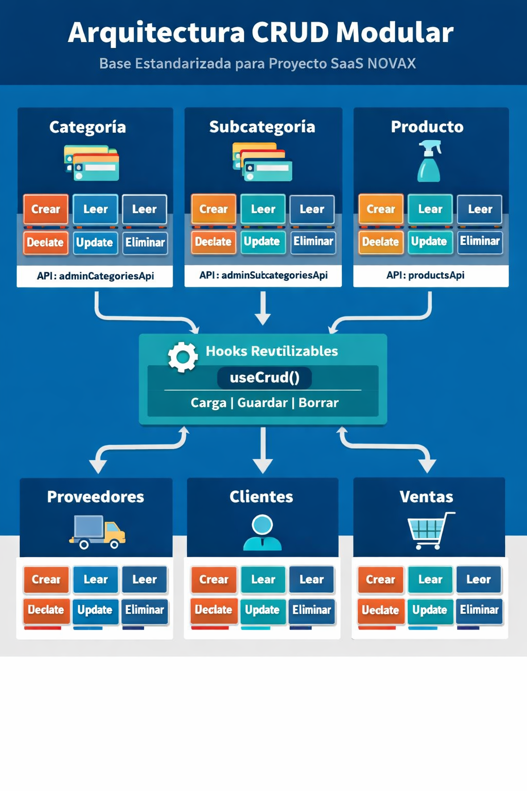
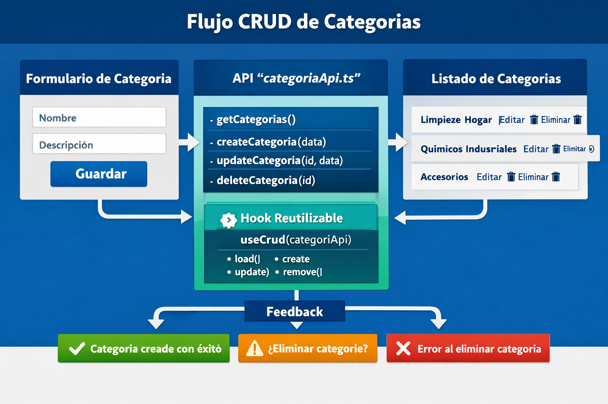

Perfecto, ahora sí estamos en etapa de planificación y tu idea está clara: quieres que el módulo de **categorías** y el de **subcategorías** sean independientes, y que además se definan bajo una arquitectura CRUD estandarizada que luego se pueda replicar en otros módulos como productos, proveedores, clientes y ventas.  

Aquí te propongo una **arquitectura base** para tu SaaS de NOVAX:

---

## 🏗️ Estructura modular CRUD
Cada módulo (categoría, subcategoría, producto, proveedor, cliente, venta) debe seguir la misma organización:

1. **UI (Interfaz de Usuario)**  
   - Un archivo principal por módulo (`categoria.tsx`, `subcategoria.tsx`, `producto.tsx`, etc.).  
   - Cada uno con su propio formulario de **Create/Update** y su listado con opciones de **Read/Delete**.  
   - Reutilizar componentes visuales (inputs, botones, tablas, tarjetas) para mantener consistencia.  

2. **API Layer (Capa de comunicación con backend)**  
   - Cada módulo debe tener su propio archivo de API (`adminCategoriesApi`, `adminSubcategoriesApi`, `productsApi`, etc.).  
   - Las funciones CRUD deben estar estandarizadas:  
     - `createX`  
     - `getX`  
     - `updateX`  
     - `deleteX`  

3. **Estado y Hooks**  
   - Cada módulo maneja su propio estado (`useState`) y carga inicial (`useEffect`).  
   - Se recomienda crear **hooks reutilizables** (`useCrud`) que encapsulen la lógica de carga, guardado y borrado.  

4. **Confirmaciones y Validaciones**  
   - Confirmación antes de eliminar.  
   - Validaciones de campos requeridos.  
   - Mensajes de éxito/error estandarizados.  

---

## 📊 Ejemplo de flujo CRUD estandarizado
- **Categoría**  
  - Crear: nombre + descripción.  
  - Leer: listado de categorías con sus subcategorías.  
  - Actualizar: editar nombre/descripcion.  
  - Eliminar: borrar categoría y sus subcategorías asociadas.  

- **Subcategoría**  
  - Crear: nombre + descripción + categoría padre.  
  - Leer: listado dentro de cada categoría.  
  - Actualizar: editar nombre/descripcion.  
  - Eliminar: borrar subcategoría y productos asociados.  

- **Producto**  
  - Crear: nombre + descripción + subcategoría padre + atributos (precio, stock, etc.).  
  - Leer: listado de productos por subcategoría.  
  - Actualizar: editar datos del producto.  
  - Eliminar: borrar producto.  

---

## 🎨 IU estandarizada
- **Formularios**: siempre con campos alineados, etiquetas claras y botones consistentes.  
- **Listados**: tarjetas o tablas con acciones CRUD visibles (editar, eliminar).  
- **Feedback**: mensajes uniformes (ejemplo: “Guardando…”, “Eliminado con éxito”).  
- **Reutilización**: un mismo estilo visual para todos los módulos, con componentes compartidos.  

---

👉 Con esto, tu módulo de **categorías** y **subcategorías** quedará separado, pero ambos seguirán la misma arquitectura CRUD que luego podrás replicar en productos, proveedores, clientes y ventas.  

¿Quieres que te arme un **diagrama visual de la arquitectura CRUD modular** para que veas cómo se conectan categorías → subcategorías → productos y cómo se replica en los demás módulos?


Aquí tienes el **mapa visual de la arquitectura CRUD modular** que diseñamos para tu proyecto NOVAX.  

[Imagen generada: Arquitectura CRUD Modular]  




Este esquema muestra cómo se organizan los módulos principales:  
- **Categoría → Subcategoría → Producto** en la parte superior, cada uno con sus operaciones CRUD estandarizadas.  
- **Hooks reutilizables (`useCrud`)** en el centro, que encapsulan la lógica común de carga, guardado y borrado.  
- **Proveedores, Clientes y Ventas** en la parte inferior, conectados al mismo patrón CRUD para mantener consistencia en todo el SaaS.  

De esta manera, tu sistema tendrá una **base uniforme y escalable**: cualquier nuevo módulo que agregues (por ejemplo inventario, reportes, etc.) seguirá exactamente la misma arquitectura, lo que facilita mantenimiento y crecimiento.  

¿Quieres que avancemos ahora en definir **los componentes compartidos de IU** (inputs, botones, tablas, tarjetas) que servirán como plantilla visual para todos los módulos?

Perfecto, LP. Ya tenemos el mapa visual de la arquitectura CRUD modular como base para tu SaaS NOVAX. Ahora vamos a definir los **componentes compartidos de IU (Interfaz de Usuario)** que se usarán en todos los módulos para mantener consistencia, accesibilidad y escalabilidad.

---

## 🎨 Componentes UI base para todos los módulos

### 1. **Formulario CRUD**
- **Inputs estandarizados**:  
  - `TextInput`: para nombre, descripción, etc.  
  - `SelectInput`: para relaciones (ej. categoría padre, cliente tipo).  
  - `NumberInput`: para precios, cantidades, etc.  
  - `DateInput`: para fechas de venta, registro, etc.  
- **Botones**:  
  - `Guardar` (Create/Update)  
  - `Eliminar` (Delete)  
  - `Cancelar` (Reset o cerrar modal)  
- **Validaciones**: campos requeridos, tipos de datos, mensajes de error claros.

---

### 2. **Listado / Árbol / Tabla**
- **Tarjetas o tablas** con acciones CRUD visibles:  
  - Iconos para editar 🖉 y eliminar 🗑  
  - Visualización jerárquica (ej. categoría → subcategoría → producto)  
  - Filtros y búsqueda por nombre, fecha, estado, etc.  
- **Skeleton loading** para carga inicial  
- **Mensajes vacíos**: “No hay registros disponibles”

---

### 3. **Modal / Panel lateral**
- Para formularios de edición o creación sin recargar la vista principal.  
- Reutilizable en todos los módulos.  
- Transiciones suaves y accesibles.

---

### 4. **Feedback y estado**
- **Toasts o alertas** para éxito, error, advertencia.  
- **Indicadores de carga** (`saving`, `loading`)  
- **Confirmaciones** antes de eliminar.

---

### 5. **Estilo visual**
- Paleta coherente: fondo oscuro, acentos en azul y naranja.  
- Tipografía clara y jerarquía visual.  
- Espaciado y bordes consistentes (`border-radius`, `gap`, `padding`).  
- Accesibilidad: contraste, etiquetas, navegación con teclado.

---

## 🧩 Reutilización y escalabilidad
- Todos los componentes deben estar en una carpeta común (`components/ui`)  
- Cada módulo importa y usa los mismos componentes, solo cambia el contenido.  
- Esto permite que cualquier cambio visual se propague a todo el sistema.

---

¿Quieres que te proponga ahora una **estructura de carpetas y archivos** para organizar estos componentes y módulos en tu proyecto Next.js? También puedo ayudarte a definir el primer hook `useCrud()` que encapsule la lógica común.

Perfecto, LP. Aquí tienes la propuesta de **estructura de carpetas y archivos** para tu proyecto SaaS NOVAX, pensada para escalar y mantener consistencia en todos los módulos CRUD:

---

## 📁 Estructura de carpetas base

```
frontend/src
│
├── components
│   └── ui
│       ├── FormInput.tsx
│       ├── SelectInput.tsx
│       ├── Button.tsx
│       ├── Modal.tsx
│       ├── Toast.tsx
│       └── Skeleton.tsx
│
├── app/app/admin
│   ├── categoria
│   │   ├── CategoriaPage.tsx
│   │   ├── CategoriaForm.tsx
│   │   ├── CategoriaList.tsx
│   │   └── categoriaApi.ts
│   │
│   ├── subcategoria
│   │   ├── SubcategoriaPage.tsx
│   │   ├── SubcategoriaForm.tsx
│   │   ├── SubcategoriaList.tsx
│   │   └── subcategoriaApi.ts
│   │
│   ├── producto
│   │   ├── ProductoPage.tsx
│   │   ├── ProductoForm.tsx
│   │   ├── ProductoList.tsx
│   │   └── productoApi.ts
│   │
│   ├── proveedor
│   ├── cliente
│   └── venta
│
├── hooks
│   └── useCrud.ts
│
├── styles
│   └── theme.ts
│
└── utils
    └── validators.ts
    
```

---

## 🧠 Lógica del hook `useCrud.ts`

Este hook encapsula la lógica común para todos los módulos:
- `load()` → carga inicial de datos  
- `create()` → guardar nuevo registro  
- `update()` → modificar registro existente  
- `delete()` → eliminar registro  
- `saving`, `loading` → estados globales  
- `toast()` → feedback visual  

Cada módulo lo invoca con su propia API y estructura de datos, pero la lógica es compartida.

---

## 🧩 Ventajas de esta estructura

- **Modularidad total**: cada módulo tiene su carpeta, sus componentes y su API.  
- **Reutilización**: los componentes UI y el hook `useCrud` se usan en todos los módulos.  
- **Escalabilidad**: puedes agregar nuevos módulos sin romper la arquitectura.  
- **Mantenibilidad**: cualquier cambio visual o funcional se propaga fácilmente.  
- **Claridad**: cada archivo tiene una responsabilidad única.

---

¿Quieres que ahora definamos los **nombres y props de los componentes UI base** como `FormInput`, `SelectInput`, `Button`, etc., para que puedas empezar a codificarlos con claridad? También puedo ayudarte a bosquejar el `useCrud` en pseudocódigo si lo deseas.

Genial, avancemos con la **definición de los componentes UI base** y sus props, para que tengas una plantilla clara y reutilizable en todos los módulos CRUD de NOVAX:

---

## 🎨 Componentes UI compartidos

### 1. **FormInput**
- **Props**:  
  - `label: string` → texto de la etiqueta  
  - `value: string | number` → valor actual  
  - `onChange: (val) => void` → función para actualizar  
  - `type?: "text" | "number" | "email" | "password"`  
  - `required?: boolean`  
- **Uso**: campos de texto, números, etc.

---

### 2. **SelectInput**
- **Props**:  
  - `label: string`  
  - `options: { value: string | number, label: string }[]`  
  - `value: string | number`  
  - `onChange: (val) => void`  
  - `required?: boolean`  
- **Uso**: selección de categoría padre, cliente tipo, proveedor, etc.

---

### 3. **Button**
- **Props**:  
  - `text: string`  
  - `onClick: () => void`  
  - `variant?: "primary" | "secondary" | "danger"`  
  - `disabled?: boolean`  
- **Uso**: acciones CRUD (guardar, eliminar, cancelar).

---

### 4. **Modal**
- **Props**:  
  - `title: string`  
  - `isOpen: boolean`  
  - `onClose: () => void`  
  - `children: ReactNode`  
- **Uso**: edición/creación sin recargar la vista principal.

---

### 5. **Toast**
- **Props**:  
  - `message: string`  
  - `type: "success" | "error" | "warning"`  
  - `duration?: number`  
- **Uso**: feedback visual tras operaciones CRUD.

---

### 6. **Skeleton**
- **Props**:  
  - `height?: string | number`  
  - `width?: string | number`  
- **Uso**: mostrar carga inicial.

---

## 🧠 Hook `useCrud` (pseudocódigo)

```ts
function useCrud(api) {
  const [data, setData] = useState([]);
  const [loading, setLoading] = useState(true);
  const [saving, setSaving] = useState(false);

  const load = async () => { setLoading(true); const res = await api.get(); setData(res); setLoading(false); };
  const create = async (item) => { setSaving(true); await api.create(item); await load(); setSaving(false); };
  const update = async (id, item) => { setSaving(true); await api.update(id, item); await load(); setSaving(false); };
  const remove = async (id) => { if (!confirm("¿Eliminar?")) return; await api.delete(id); await load(); };

  return { data, loading, saving, load, create, update, remove };
}
```

---

Con esta base, cada módulo (categoría, subcategoría, producto, proveedor, cliente, venta) solo necesita **su propia API** y puede reutilizar los mismos componentes y el hook `useCrud`.  

¿Quieres que te arme ahora un **ejemplo de flujo completo** (UI + hook + API) aplicado a *Categorías*, para que veas cómo se integra todo en un módulo real?

Perfecto, veamos el **flujo completo para el módulo de Categorías** dentro de tu SaaS NOVAX. Esto servirá como plantilla para todos los demás módulos:

---

## 🏗️ Flujo CRUD de Categorías

### 1. **API Layer (`categoriaApi.ts`)**
Funciones estandarizadas:
- `getCategorias()` → obtiene todas las categorías.  
- `createCategoria(data)` → crea una nueva categoría.  
- `updateCategoria(id, data)` → actualiza una categoría existente.  
- `deleteCategoria(id)` → elimina una categoría.  

👉 Esta capa se conecta directamente al backend y mantiene la lógica separada de la UI.

---

### 2. **Hook Reutilizable (`useCrud`)**
Invocado con la API de categorías:
```ts
const { data: categorias, loading, saving, load, create, update, remove } = useCrud(categoriaApi);
```
- `load()` → carga inicial de categorías.  
- `create()` → guarda una nueva categoría.  
- `update()` → modifica una categoría existente.  
- `remove()` → elimina una categoría con confirmación.  

---

### 3. **UI Components**
- **CategoriaForm.tsx**  
  - Inputs: nombre, descripción.  
  - Botón Guardar → llama a `create()` o `update()`.  

- **CategoriaList.tsx**  
  - Listado de categorías en tarjetas o tabla.  
  - Botones Editar 🖉 y Eliminar 🗑 → llaman a `update()` y `remove()`.  
  - Skeleton mientras carga.  
  - Mensaje vacío si no hay categorías.  

- **CategoriaPage.tsx**  
  - Contenedor principal que integra `CategoriaForm` y `CategoriaList`.  
  - Usa el hook `useCrud(categoriaApi)` para manejar estado y operaciones.  

---

### 4. **Feedback**
- **Toast**: “Categoría creada con éxito”, “Error al eliminar categoría”.  
- **Modal**: edición rápida sin salir de la lista.  
- **Confirmación**: antes de eliminar.  

---

### 5. **Escalabilidad**
Este mismo patrón se replica en:
- **Subcategorías**: nombre, descripción, categoría padre.  
- **Productos**: nombre, descripción, subcategoría padre, atributos.  
- **Proveedores, Clientes, Ventas**: cada uno con sus propios campos, pero misma arquitectura CRUD.

---

👉 Con este flujo, el módulo de **Categorías** queda totalmente estandarizado y sirve como **base para todos los demás módulos**.  

¿Quieres que te prepare un **diagrama visual del flujo CRUD de Categorías** (Formulario → API → Hook → Listado → Feedback) para que lo tengas como referencia rápida?

Aquí tienes el **diagrama visual del flujo CRUD de Categorías** que diseñamos como ejemplo para tu SaaS NOVAX.  

[Imagen generada: Flujo CRUD de Categorías]  



Este flujo muestra de manera clara cómo se conectan las piezas:  
1. **Formulario de Categoría** → donde se ingresan nombre y descripción, y se guarda.  
2. **API `categoriaApi.ts`** → con las funciones `getCategorias`, `createCategoria`, `updateCategoria`, `deleteCategoria`.  
3. **Hook Reutilizable `useCrud(categoriaApi)`** → que centraliza la lógica (`load`, `create`, `update`, `remove`).  
4. **Listado de Categorías** → visualización con opciones de editar y eliminar.  
5. **Feedback** → confirmaciones y mensajes de éxito/error.  

De esta forma, el módulo de Categorías queda totalmente estandarizado y sirve como **plantilla para replicar en Subcategorías, Productos, Proveedores, Clientes y Ventas**.  

¿Quieres que el siguiente paso sea definir cómo se integran **Subcategorías dentro de Categorías** en este mismo flujo, para que veas la jerarquía completa hasta llegar a Productos?

Aquí tienes el **flujo completo CRUD para el módulo de Categorías**, visualizado como plantilla base para tu proyecto NOVAX:

---

## 🧩 Flujo CRUD de Categorías

### 1. **Formulario de Categoría**
- Campos:  
  - `Nombre`  
  - `Descripción`  
- Acción:  
  - Botón **Guardar** → llama a `createCategoria()` o `updateCategoria()` según contexto.  
- Componente: `CategoriaForm.tsx`  
- UI: reutiliza `FormInput`, `Button`, `Toast`.

---

### 2. **API Layer (`categoriaApi.ts`)**
- Funciones:  
  - `getCategorias()` → consulta todas las categorías.  
  - `createCategoria(data)` → crea nueva categoría.  
  - `updateCategoria(id, data)` → actualiza categoría existente.  
  - `deleteCategoria(id)` → elimina categoría.  
- Estándar: todas las funciones siguen el mismo patrón que otros módulos.

---

### 3. **Hook Reutilizable (`useCrud`)**
- Invocado como:  
  ```ts
  const { data, loading, saving, load, create, update, remove } = useCrud(categoriaApi);
  ```
- Centraliza lógica CRUD.  
- Se usa en `CategoriaPage.tsx` para manejar estado y operaciones.

---

### 4. **Listado de Categorías**
- Componente: `CategoriaList.tsx`  
- Muestra tarjetas o tabla con:  
  - Nombre  
  - Descripción  
  - Botones: **Editar 🖉**, **Eliminar 🗑**  
- Usa `Skeleton` para carga y `Toast` para feedback.  
- Mensaje si no hay categorías: “No hay registros disponibles”.

---

### 5. **Feedback**
- Confirmación antes de eliminar.  
- Toasts:  
  - ✅ “Categoría creada con éxito”  
  - ⚠️ “¿Eliminar categoría?”  
  - ❌ “Error al eliminar categoría”

---

Este flujo es **modular, escalable y reutilizable**. Puedes replicarlo en Subcategorías, Productos, Proveedores, Clientes y Ventas cambiando solo los campos y la API.

¿Quieres que ahora integremos **Subcategorías dentro de este flujo**, mostrando cómo se relacionan jerárquicamente con Categorías y cómo se visualizan en el árbol?

Aquí tienes el **diagrama visual del flujo CRUD de Categorías y Subcategorías**, que muestra cómo se integran jerárquicamente en tu proyecto NOVAX:

`https://copilot.microsoft.com/th/id/BCO.56bd474c-bb8d-4457-8bfe-7f239b1881ef.png`

---

## 🧠 ¿Qué representa este flujo?

- **Formulario compartido**: puedes crear tanto categorías como subcategorías desde un mismo panel, seleccionando la categoría padre si corresponde.  
- **API modular**: cada entidad tiene su propia API (`categoriaApi.ts`, `subcategoriaApi.ts`), pero ambas se integran en el árbol visual.  
- **Hook reutilizable**: `useCrud()` se adapta a cada módulo, manteniendo la lógica centralizada.  
- **Árbol de categorías**: muestra la jerarquía completa, desde “Limpieza Hogar” hasta “Detergentes Hogar” y productos como “Lavavajillas”.  
- **Feedback estandarizado**: éxito, confirmación y errores se manejan igual en todos los módulos.

---

Este flujo te permite visualizar cómo se conectan las entidades y cómo se puede escalar el sistema para incluir productos, proveedores, clientes y ventas sin romper la estructura.

¿Quieres que el siguiente paso sea definir cómo se integran **Productos** dentro de Subcategorías, completando el tercer nivel de tu jerarquía? También puedo ayudarte a visualizar cómo se vería el árbol completo desde Categoría → Subcategoría → Producto.

